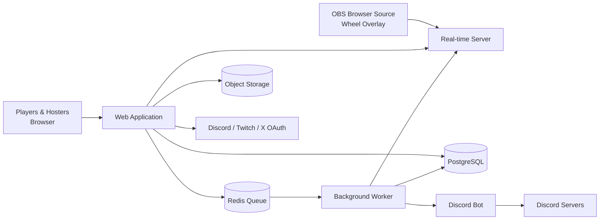
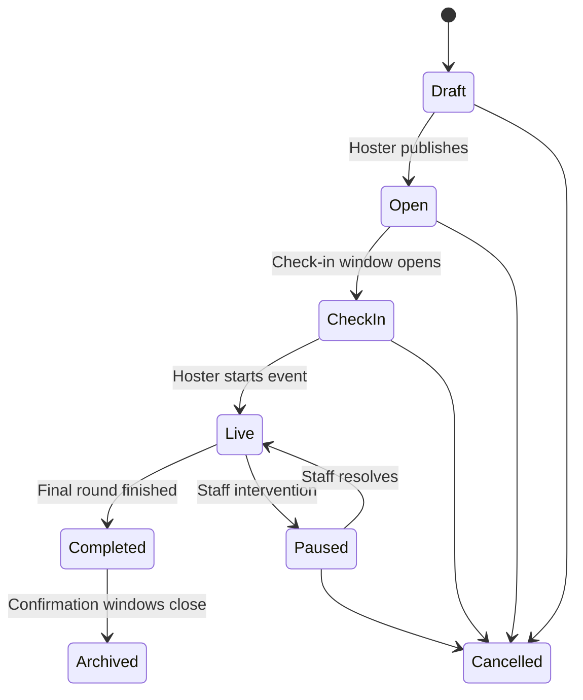
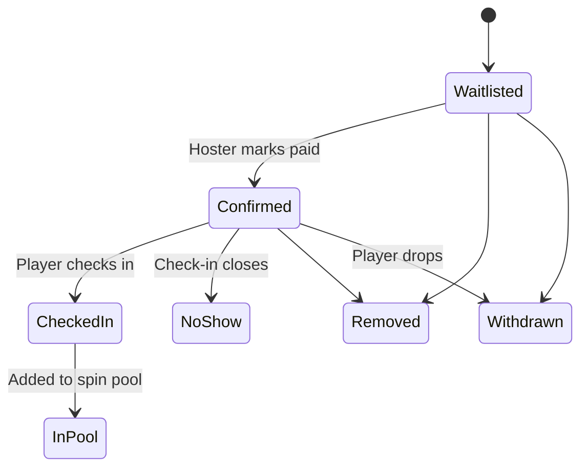
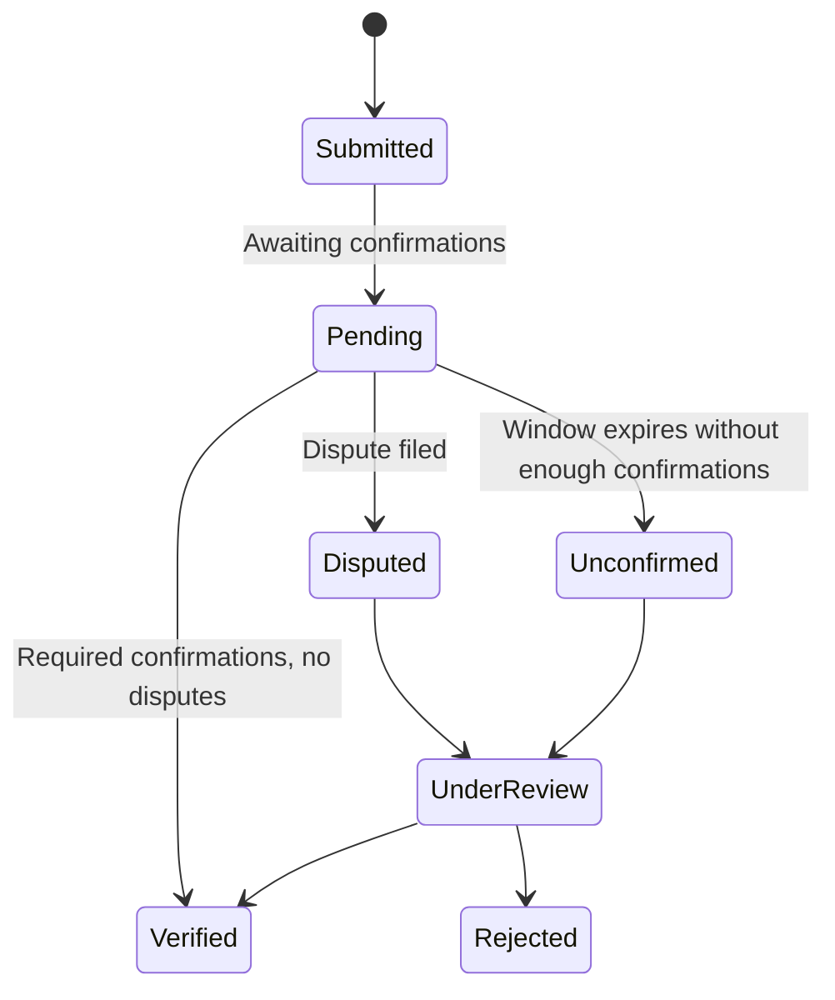

# Architecture and Design Patterns

_Companion to: Planning Document, Tech Stack, Data Model_
_Status: Planning (no development started)_

---

## 1. System Requirements

The architecture is shaped by six core technical needs drawn from the planning document.

| Requirement                                 | Where it comes from                                                                                                                               |
| ------------------------------------------- | ------------------------------------------------------------------------------------------------------------------------------------------------- |
| **Heavily connected relational data**       | Users, hosters, events, sign-ups, rounds, matches, results, confirmations, reports, blacklist entries, and staff actions all reference each other |
| **Sign-in through other platforms (OAuth)** | Players and hosters link Discord, Twitch, and X; Activision ID is entered manually                                                                |
| **Real-time updates**                       | Wheel overlay, live sign-up counts, check-in status, live leaderboards                                                                            |
| **Scheduled and background work**           | Verification windows, payout confirmation deadlines, waitlist promotion, check-in closing, notifications, Discord posts                           |
| **File uploads**                            | Scoreboard screenshots and report evidence                                                                                                        |
| **Fine-grained permissions**                | Role permissions plus situational rules such as recusal, two-person approval, and hosters managing only their own events                          |

---

## 2. High-Level Architecture

### 2.1 Modular monolith

The platform is built as a **modular monolith**: one application and one database, organized internally into clearly separated modules.

**Why not microservices:** Microservices add deployment, networking, and debugging complexity that isn't justified for a solo developer or small team at this stage. A modular monolith is simpler to build, deploy, and maintain.

**Why modules still matter:** Strict internal boundaries keep the codebase understandable as it grows and allow a module to be split into its own service later if it ever needs to scale independently.

**Module rules:**

- Each module owns its own data and logic.
- Modules communicate through clearly defined interfaces and internal domain events, never by reaching directly into another module's internals or tables.
- Shared code (validation rules, types, utilities) lives in a common shared layer.

### 2.2 Deployable components

Although the core is one application, the system runs as a few separate processes:

| Component             | Role                                                                            |
| --------------------- | ------------------------------------------------------------------------------- |
| **Web application**   | Public pages, dashboards, and the API                                           |
| **Real-time server**  | Pushes live updates to browsers and overlays (may be a managed service instead) |
| **Background worker** | Runs scheduled jobs, timers, and reactions to domain events                     |
| **Discord bot**       | Posts new events to community servers; later, additional commands               |
| **Database**          | Single PostgreSQL instance holding all module data                              |
| **Cache/queue store** | Redis, backing the job queue and real-time features                             |
| **File storage**      | Object storage for screenshots and evidence                                     |

The worker and the Discord bot share the same codebase and modules as the web application; they are simply different entry points.

### 2.3 System overview

---

## 3. Modules

| Module            | Responsibilities                                                                                           |
| ----------------- | ---------------------------------------------------------------------------------------------------------- |
| **Identity**      | Accounts, sign-in, linked platforms (Discord, Twitch, X), Activision ID, stream links, roles               |
| **Events**        | Event creation, templates, rules, listings, filtering, the event lifecycle                                 |
| **Registration**  | Sign-ups, hoster-marked payment status, waitlist and promotion, join links, quick-add, check-in, no-shows  |
| **Wheel**         | Spin pools, provably fair spins, spin logs, overlay data                                                   |
| **Matches**       | Rounds, team assignments, matches, result submission, confirmations, disputes                              |
| **Reputation**    | Verified stats, teammate ratings, payout confirmations, hoster reviews, hoster tiers, badges, leaderboards |
| **Moderation**    | Reports, evidence, warnings, suspensions, blacklist, appeals, staff notes, staff action log                |
| **Notifications** | In-site notifications, confirmation prompts, deadline reminders; later email or Discord DMs                |
| **Integrations**  | Discord bot, share links for X, Twitch features (later), screenshot text recognition (later)               |

### 3.1 Module dependencies (allowed directions)

- **Identity** is foundational; every module may reference users and roles.
- **Events** depends on Identity.
- **Registration** depends on Events and Identity.
- **Wheel** depends on Registration (to build the spin pool).
- **Matches** depends on Wheel and Registration.
- **Reputation** and **Notifications** react to events from other modules rather than being called directly.
- **Moderation** may read from any module (to review cases) and can act on Identity (suspensions) and Registration (removals), but only through those modules' interfaces.

---

## 4. Design Patterns

### 4.1 State machines for lifecycles

Anything with stages has an explicitly defined set of states and allowed transitions. Any transition not listed is rejected. This prevents whole classes of bugs, such as confirming a result for a cancelled event.

**Event lifecycle**

**Registration lifecycle**

**Match result lifecycle**

**Report lifecycle:** Submitted → Gathering Evidence → Awaiting Response (accused party) → Under Review → Actioned or Dismissed → (optionally) Appealed → Upheld or Overturned.

**Blacklist entry lifecycle:** Proposed → Awaiting Second Approval → Active → Expired or Removed on Appeal.

### 4.2 Internal domain events

When something important happens, the owning module announces it, and other modules react without the owning module knowing they exist.

| Domain event                       | Example reactions                                                                |
| ---------------------------------- | -------------------------------------------------------------------------------- |
| `EventPublished`                   | Discord bot posts the listing; share links become available                      |
| `PlayerMarkedPaid`                 | Registration updates counts; real-time pushes the new count                      |
| `RegistrationWithdrawn`            | Waitlist promotes the next player; notification sent                             |
| `CheckInClosed`                    | Remaining confirmed players marked as no-shows; reputation updated               |
| `SpinCompleted`                    | Overlay animates the result; teams are created for the round                     |
| `ResultSubmitted`                  | Confirmation prompts sent; verification window timer scheduled                   |
| `MatchVerified`                    | Reputation updates stats; leaderboard refreshes; later, throw detection runs     |
| `EventCompleted`                   | Payout confirmation prompts sent to winners; review prompts sent to participants |
| `PayoutConfirmed` / `PayoutDenied` | Hoster reputation updated; a denial may open a report automatically              |
| `BlacklistEntryActivated`          | Affected player flagged on all future sign-ups                                   |

**Implementation approach:** Events are written to the database in the same transaction as the change that caused them (the "outbox" pattern), then picked up and processed by the background worker. This guarantees no event is lost if the server crashes mid-operation.

### 4.3 Role-based access with central policy checks

Permissions work in two layers:

1. **Roles** define broad permissions: Player, Hoster, Trial Moderator, Moderator, Admin.
2. **Policies** handle situational rules on top of roles.

| Policy              | Rule                                                                                                                     |
| ------------------- | ------------------------------------------------------------------------------------------------------------------------ |
| Event ownership     | Hosters can only manage their own events                                                                                 |
| Recusal             | Staff cannot act on cases involving themselves, friends they've flagged as conflicts, or events they hosted or played in |
| Two-person approval | Blacklist entries and permanent bans require a second, different staff member                                            |
| Appeal independence | Appeals must be handled by staff not involved in the original decision                                                   |
| Trial mod limits    | Trial moderators can recommend, but not approve, blacklist entries and suspensions                                       |
| Data minimization   | Staff see only the data needed for the case in front of them                                                             |

**All permission and policy checks live in one central place** in the codebase, never scattered across individual pages or endpoints. Every sensitive action passes through it.

### 4.4 Append-only audit log

Every staff action is written to a log that can only be added to, never edited or deleted. Each entry records who acted, what they did, what it affected, when, and the required stated reason.

This is enforced at the database level (the application's database user has no permission to update or delete log rows), so accountability does not depend on the code behaving correctly.

### 4.5 Provably fair wheel spins (commit-reveal)

1. The spin result is always decided **on the server**, never in a browser, so viewers or hosters cannot tamper with it.
2. **Before the spin**, the server generates a secret random value and publishes a hash (a scrambled fingerprint) of it alongside the list of players in the pool.
3. The hoster triggers the spin. The server uses the secret value to determine the result, and the overlay animates it.
4. **After the spin**, the server reveals the secret value.
5. Anyone can verify that the revealed value matches the published fingerprint and produces the same result from the same pool, proving the outcome was locked in before the spin and was not altered.

All spins, fingerprints, revealed values, and pools are stored permanently in the spin log and shown publicly on the event page.

### 4.6 Overlay as a lightweight web page

- The overlay is a minimal page loaded by OBS as a browser source, using a unique, unguessable URL per hoster or event.
- It only displays; it never decides anything.
- It subscribes to real-time updates for that event. When the hoster triggers a spin from their dashboard, the server decides the result and the overlay animates to it.
- The overlay URL can be regenerated if leaked.

### 4.7 Scheduled jobs and timers

Time-based rules are handled by delayed jobs in the background worker rather than by checking on page loads:

- Closing check-in windows
- Expiring result verification windows (e.g., 24 hours)
- Payout confirmation deadlines and reminders
- Waitlist payment deadlines before spins
- Blacklist entry expiry for lesser offenses
- Periodic leaderboard recalculation

Jobs are designed to be safe to run more than once (idempotent), so a retry after a failure never double-applies an effect.

### 4.8 Evidence and file handling

- Files upload directly from the browser to object storage using short-lived, pre-authorized upload links, keeping large files off the web server.
- Files are private by default and served through short-lived access links.
- Report evidence is visible only to staff and, where appropriate, the parties involved.
- Uploaded files are checked for type and size; images may be re-processed to strip hidden metadata.

---

## 5. Cross-Cutting Concerns

### 5.1 Security

- OAuth-based sign-in; no passwords stored for social accounts.
- Rate limiting on sign-ups, submissions, reports, and confirmations to prevent spam and abuse.
- Protection against duplicate or alternate accounts (e.g., requiring a linked Discord account and checking for reused linked accounts).
- All user-generated content is sanitized before display.
- Staff accounts may require additional verification for sensitive actions.

### 5.2 Privacy

- Private data (emails, internal notes, staff identities on decisions) is never exposed publicly.
- Public actions are attributed to "staff" only; specific staff are recorded internally.
- Support for data deletion requests, balanced against the need to retain moderation records.

### 5.3 Reliability

- Domain events use the outbox pattern so none are lost.
- Background jobs retry automatically on failure.
- Regular automated database backups.
- Error tracking and basic monitoring from day one.

### 5.4 Performance

- Public listings are cached, since they are read far more often than written.
- Leaderboards and reputation summaries are pre-calculated rather than computed on every page view.
- Real-time updates are scoped per event, so viewers only receive updates for what they're watching.

---

## 6. Phase Alignment

| Phase       | Architecture work                                                                                                                                                                       |
| ----------- | --------------------------------------------------------------------------------------------------------------------------------------------------------------------------------------- |
| **Phase 1** | Identity, Events, Registration, Wheel (with commit-reveal), basic rounds and team assignments from Matches, core Moderation, audit log, real-time, background worker, basic Discord bot |
| **Phase 2** | Matches with full verification flow, Reputation (stats, ratings, tiers, badges), public blacklist with appeals, file uploads for screenshots                                            |
| **Phase 3** | Throw detection (reacting to `MatchVerified`), screenshot text recognition, leaderboards, optional randomization modes, Twitch chat integration                                         |
