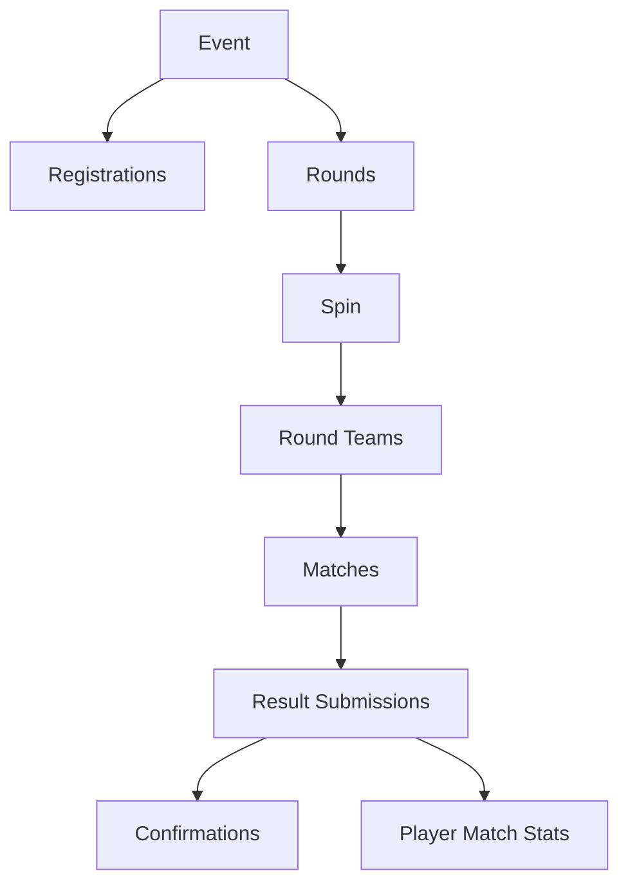
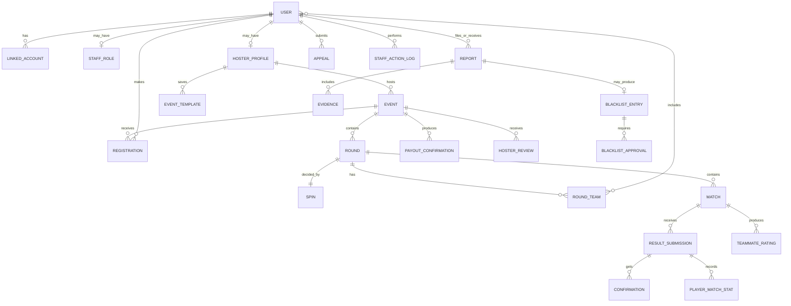

# Data Model Outline

_Companion to: Planning Document, Architecture and Design Patterns, Tech Stack_
_Status: Conceptual outline. Field lists show key information only; full schema to be designed during development._

---

## 1. Overview

The data model is organized by the modules defined in the architecture document. Each entity belongs to exactly one module, which is responsible for creating and changing it. Other modules may read it or react to its changes.

### 1.1 How a switcheroo is structured

An **event** has many **registrations** (players). Each **round** has one **spin**, which produces that round's **teams**. Teams face each other in **matches**, whose results are **submitted** with screenshots, **confirmed** by players, and once verified produce **player stats**.

---

## 2. Identity Module

### User

The core account for every person on the site.

| Key information     | Notes                                |
| ------------------- | ------------------------------------ |
| Display name        |                                      |
| Activision ID       | Entered manually; no API integration |
| Primary stream link | Twitch or other platform             |
| Account status      | Active, warned, suspended, banned    |
| Created date        |                                      |

### Linked Account

A platform connected to a user through sign-in (Discord, Twitch, X).

| Key information                | Notes                                          |
| ------------------------------ | ---------------------------------------------- |
| User                           |                                                |
| Platform                       | Discord, Twitch, X                             |
| Platform account ID and handle | Used to detect duplicate or alternate accounts |

A user can have one linked account per platform. A platform account can belong to only one user.

### Staff Role

A user's staff assignment, kept separate from their public profile.

| Key information          | Notes                                                              |
| ------------------------ | ------------------------------------------------------------------ |
| User                     |                                                                    |
| Role                     | Trial Moderator, Moderator, Admin, Founder                         |
| Badge hidden             | Temporarily hides the public badge if the staff member is targeted |
| Granted by, granted date |                                                                    |

### Conflict Declaration

A staff member's declared conflicts of interest, used by the recusal policy.

| Key information | Notes                            |
| --------------- | -------------------------------- |
| Staff user      |                                  |
| Conflicted user | e.g., a close friend or teammate |

---

## 3. Events Module

### Hoster Profile

Created when a user registers as a hoster.

| Key information   | Notes                                     |
| ----------------- | ----------------------------------------- |
| User              |                                           |
| Tier              | New, Verified, Trusted                    |
| Tier set manually | Whether staff overrode the automatic tier |
| Founding Hoster   | Yes/no                                    |

### Event Template

Saved settings a hoster reuses for new events.

| Key information | Notes                                                      |
| --------------- | ---------------------------------------------------------- |
| Hoster          |                                                            |
| Template name   |                                                            |
| Saved settings  | Mode, format, team size, rounds, rules, payout split, etc. |

### Event

| Key information             | Notes                                                               |
| --------------------------- | ------------------------------------------------------------------- |
| Hoster                      |                                                                     |
| Title and description       |                                                                     |
| Mode                        | SnD, Hardpoint                                                      |
| Format                      | Switcheroo, standard tournament (listing only)                      |
| Team size                   | e.g., 2v2, 4v4                                                      |
| Number of rounds            | Switcheroo only                                                     |
| Player cap                  |                                                                     |
| Entry fee and payout split  | Display only; the site does not handle money                        |
| Region / platform           |                                                                     |
| Rules                       | Map pool, banned items, streaming/monicam requirement               |
| Entry type                  | Open, requirement-based, invite-only                                |
| Entry requirements          | For requirement-based events                                        |
| Start time, check-in window | Stored in UTC; displayed in viewer's timezone                       |
| Status                      | Draft, Open, Check-In, Live, Paused, Completed, Archived, Cancelled |
| Join link code              | Short code for Twitch chat sign-ups                                 |
| Overlay key                 | Unguessable, regenerable key for the OBS overlay URL                |

---

## 4. Registration Module

### Registration

A player's sign-up for an event.

| Key information                | Notes                                                                          |
| ------------------------------ | ------------------------------------------------------------------------------ |
| Event, player                  | One registration per player per event                                          |
| Status                         | Waitlisted, Confirmed (paid), Checked In, In Pool, No-Show, Withdrawn, Removed |
| Marked paid by, marked paid at | Hoster action                                                                  |
| Waitlist position              |                                                                                |
| Sign-up source                 | Website, join link, hoster quick-add                                           |
| Checked in at                  |                                                                                |

### Event Invite

For invite-only events.

| Key information     | Notes                       |
| ------------------- | --------------------------- |
| Event, invited user |                             |
| Status              | Pending, accepted, declined |

---

## 5. Wheel Module

### Spin

One wheel spin for one round, recorded permanently and shown publicly.

| Key information                    | Notes                                    |
| ---------------------------------- | ---------------------------------------- |
| Event, round                       |                                          |
| Player pool snapshot               | Exactly who was in the pool at spin time |
| Commitment hash                    | Published before the spin                |
| Revealed secret                    | Published after the spin                 |
| Result                             | Resulting team assignments               |
| Committed at, spun at, revealed at |                                          |
| Triggered by                       | The hoster                               |

---

## 6. Matches Module

### Round

| Key information | Notes                                |
| --------------- | ------------------------------------ |
| Event           |                                      |
| Round number    |                                      |
| Status          | Pending, Spun, In Progress, Complete |

### Round Team

A team created by a spin for a single round.

| Key information | Notes                                  |
| --------------- | -------------------------------------- |
| Round           |                                        |
| Team label      |                                        |
| Members         | Links to players (via team membership) |

### Match

| Key information | Notes                                                                         |
| --------------- | ----------------------------------------------------------------------------- |
| Round           |                                                                               |
| Team A, Team B  | Round teams                                                                   |
| Map(s)          |                                                                               |
| Status          | Scheduled, Played, Result Pending, Verified, Disputed, Under Review, Rejected |
| Winning team    | Set once verified                                                             |

### Result Submission

| Key information       | Notes                                                                       |
| --------------------- | --------------------------------------------------------------------------- |
| Match                 |                                                                             |
| Submitted by          | A player in the match or the hoster                                         |
| Scoreboard screenshot | Required                                                                    |
| Reported score        |                                                                             |
| Status                | Submitted, Pending, Verified, Disputed, Unconfirmed, Under Review, Rejected |
| Verification deadline | e.g., 24 hours after submission                                             |

### Player Match Stat

One player's stats for one match. Only counts toward profiles once the submission is verified.

| Key information           | Notes     |
| ------------------------- | --------- |
| Match, player, submission |           |
| Kills, deaths             |           |
| Plants, defuses           | SnD       |
| Hill time                 | Hardpoint |
| Verified                  | Yes/no    |

### Confirmation

| Key information                     | Notes              |
| ----------------------------------- | ------------------ |
| Submission, player                  |                    |
| Response                            | Confirm or dispute |
| Dispute reason and corrected values | If disputed        |
| Responded at                        |                    |

### Dispute Resolution

| Key information    | Notes           |
| ------------------ | --------------- |
| Submission         |                 |
| Resolved by        | Hoster or staff |
| Outcome and reason |                 |

---

## 7. Reputation Module

### Teammate Rating

| Key information            | Notes                                     |
| -------------------------- | ----------------------------------------- |
| Match, rater, rated player | Only actual teammates can rate each other |
| Would play with again      | Yes/no                                    |
| Communication, effort      | Short scale ratings                       |

### Payout Confirmation

| Key information        | Notes                       |
| ---------------------- | --------------------------- |
| Event, winner          |                             |
| Response               | Paid, not paid, no response |
| Deadline, responded at |                             |

### Hoster Review

| Key information                       | Notes                        |
| ------------------------------------- | ---------------------------- |
| Event, reviewer                       | Only participants can review |
| Organization, communication, fairness | Ratings                      |
| Comment                               | Optional, moderatable        |

### Badge and User Badge

Badges (Founder, Admin, Moderator, hoster tiers, Founding Hoster, Verified Player, Supporter) and which users hold them, with how each was earned (automatic or granted by staff).

### Reputation Summary

Pre-calculated totals per user for fast profile loading: events played and hosted, confirmed payouts, no-shows, verified stat averages, teammate rating averages, confirmation reliability. Recalculated in the background when underlying data changes.

### Leaderboard Entry (Phase 3)

Pre-calculated standings for a period (a month, a season, or all time) and game mode across all events on the site: rank, points, wins, losses, kills, deaths. Rewritten wholesale by the worker. A **Season** is an admin-defined, non-overlapping date window.

### Throw Flag (Phase 3)

A staff-only anomaly raised for moderator review after a match is verified: the player, which signal fired (performance far below their own baseline, unusually many losses in one event, unusually many losses with one teammate), the related match, event and teammate, the observed numbers, and a review status (open, under review, dismissed, escalated). Never public, never shown to the player, never a sanction; escalating opens a normal report. Detection thresholds are not stored.

### Screenshot Reading (Phase 3)

What the worker read from a submission's scoreboard screenshot: status, engine, confidence, the rows it recognised and matched to players, and any fields that disagree with the submitted stats. Advisory only. Stats it fills in are marked as read from the screenshot.

### Team formation mode (Phase 3)

Each event has a randomization mode: fully random (default), skill-balanced, or no repeat teammates. The inputs a mode uses are snapshotted into the spin pool, so they are covered by the commitment and published with the spin.

---

## 8. Moderation Module

### Report

| Key information         | Notes                                                                                      |
| ----------------------- | ------------------------------------------------------------------------------------------ |
| Reporter, reported user |                                                                                            |
| Related event or match  | Optional                                                                                   |
| Category                | Non-payment/scamming, cheating, throwing, repeated no-shows, harassment, falsified results |
| Description             |                                                                                            |
| Status                  | Submitted, Gathering Evidence, Awaiting Response, Under Review, Actioned, Dismissed        |
| Assigned staff          | Internal only                                                                              |

### Evidence

| Key information | Notes                                                      |
| --------------- | ---------------------------------------------------------- |
| Report          |                                                            |
| Type            | Screenshot, VOD link with timestamp, payment record, other |
| File or link    |                                                            |
| Submitted by    | Reporter, accused, or staff                                |

### Accused Response

The reported user's statement before any public action, with optional evidence of their own.

### Warning and Suspension

| Key information     | Notes                                        |
| ------------------- | -------------------------------------------- |
| User                |                                              |
| Type                | Warning, temporary suspension, permanent ban |
| Reason              |                                              |
| Start and end dates | For suspensions                              |
| Related report      |                                              |

### Blacklist Entry

| Key information | Notes                                                                    |
| --------------- | ------------------------------------------------------------------------ |
| User            |                                                                          |
| Category        |                                                                          |
| Public wording  | e.g., "Verified report: unpaid winnings from [event], evidence reviewed" |
| Related report  |                                                                          |
| Status          | Proposed, Awaiting Second Approval, Active, Expired, Removed             |
| Expiry date     | For lesser offenses                                                      |

### Blacklist Approval

Records each staff approval. Two different staff members are required, neither of them recused. Shown publicly only as "staff."

### Appeal

| Key information        | Notes                                                |
| ---------------------- | ---------------------------------------------------- |
| Appellant              |                                                      |
| Appealed item          | Blacklist entry, suspension, ban, or dispute ruling  |
| Statement and evidence |                                                      |
| Status                 | Submitted, Under Review, Upheld, Overturned          |
| Handled by             | Must not have been involved in the original decision |

### Staff Note

Internal-only notes on a user, visible to staff and never public.

### Staff Action Log (append-only)

| Key information | Notes                                                          |
| --------------- | -------------------------------------------------------------- |
| Staff member    |                                                                |
| Action          | e.g., approved blacklist entry, resolved dispute, paused event |
| Target          | The affected user, event, match, report, etc.                  |
| Reason          | Required                                                       |
| Timestamp       |                                                                |

Rows can only be added, never changed or deleted, enforced at the database level.

---

## 9. Notifications and System

### Notification

| Key information | Notes                                                                            |
| --------------- | -------------------------------------------------------------------------------- |
| User            |                                                                                  |
| Type            | Confirmation request, deadline reminder, waitlist promotion, report update, etc. |
| Related item    |                                                                                  |
| Read            | Yes/no                                                                           |

### Outbox Event

Domain events recorded in the same transaction as the change that caused them, then processed by the background worker. Tracks event type, payload, and processing status.

### Discord Server Configuration

Community servers where the bot posts events: server, channel, filters (e.g., only SnD, only a region), and who configured it.

---

## 10. Relationship Diagram

---

## 11. Open Questions

- Whether standard tournaments need any round or match records in the MVP, or remain listing-only with sign-ups and payout confirmations
- Exact verification window length and number of confirmations required per team
- Which stats to track for each mode beyond the core set
- Data retention rules: how long to keep moderation records after an account is deleted
- Whether teammate ratings are shown as raw scores or summarized labels on profiles
